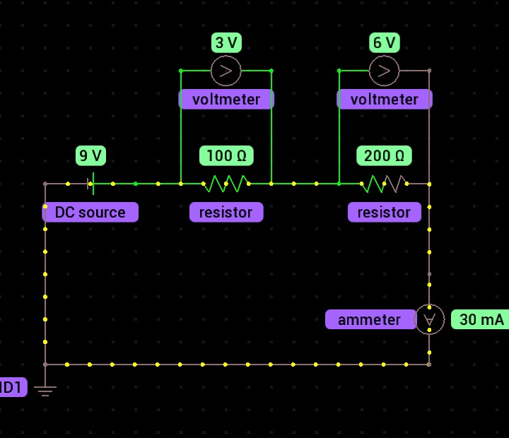
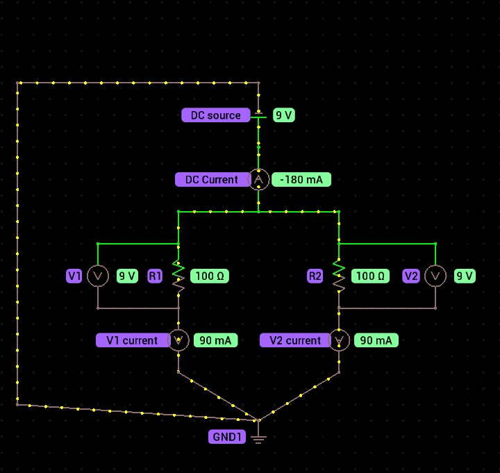
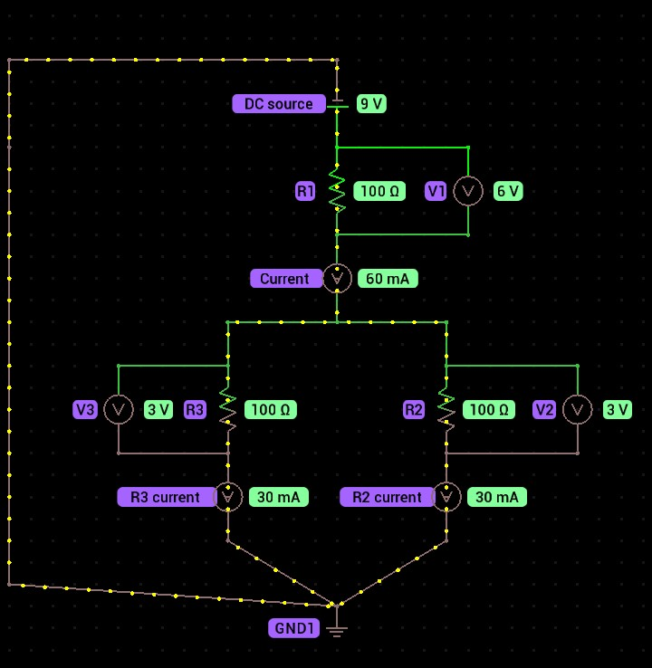
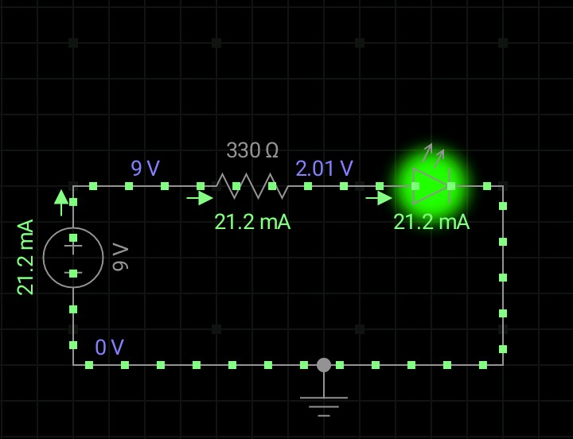
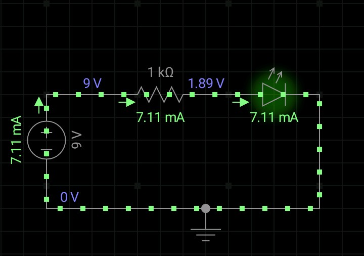

# ⚡ Electronics Phase 01 - Electrical Fundamentals

## 📖 Introduction

This repository documents my journey of learning the fundamentals of electrical engineering from first principles. Rather than memorizing formulas, I focused on understanding the physical concepts behind electricity, voltage, current, resistance, circuit analysis, electrical power, and resistors through logical reasoning and practical circuit simulations.

Every concept was reinforced with circuit experiments, predictions, and verification using a circuit simulator. This approach helped me develop engineering intuition instead of relying solely on equations.

---

## 🎯 Learning Objectives

At the end of this phase, I was able to:

- Explain what electricity is and how electric charge moves through a circuit.
- Describe voltage as electrical potential difference (energy per unit charge).
- Explain current as the rate of flow of electric charge.
- Understand resistance from the perspective of electron movement and collisions within materials.
- Apply Ohm's Law to analyze simple electrical circuits.
- Analyze series, parallel, and mixed resistor circuits.
- Understand Kirchhoff's Current Law (Conservation of Charge).
- Understand Kirchhoff's Voltage Law (Conservation of Energy).
- Calculate electrical power using multiple equivalent equations.
- Explain how resistors work physically and how they are used in practical circuits.

---

## 📚 Topics Covered

- Electricity
- Electric Charge
- Voltage
- Current
- Conductors and Insulators
- Electric Field
- Resistance
- Ohm's Law
- Series Circuits
- Parallel Circuits
- Mixed Circuits
- Kirchhoff's Current Law (KCL)
- Kirchhoff's Voltage Law (KVL)
- Electrical Power
- Resistors

  ---

# 🔬 Practical Experiments

## Experiment 1 - Series Circuit

### Objective

To understand how voltage and current behave in a series circuit.

### Prediction

Before building the circuit, I predicted that:

- Current would remain the same throughout the circuit because there is only one path for charge to flow.
- The source voltage would be shared between the resistors.
- The sum of all voltage drops would equal the battery voltage.

### Circuit

### Measurements

| Quantity | Measured Value |
|----------|---------------:|
| Supply Voltage | 9 V |
| Current | 30 mA |
| Voltage across 100 Ω | 3 V |
| Voltage across 200 Ω | 6 V |

### What I Learned

- Current remains constant throughout a series circuit.
- Components in series divide the source voltage.
- The sum of all voltage drops equals the source voltage, demonstrating Kirchhoff's Voltage Law.

---

## Experiment 2 - Parallel Circuit

### Objective

To understand how voltage and current behave in a parallel circuit.

### Prediction

Before building the circuit, I predicted that:

- Every branch would experience the full supply voltage.
- Current would divide between the branches.
- The total current supplied by the battery would equal the sum of the branch currents.

### Circuit

### Measurements

| Quantity | Measured Value |
|----------|---------------:|
| Supply Voltage | 9 V |
| Battery Current | 180 mA |
| Left Branch Current | 90 mA |
| Right Branch Current | 90 mA |
| Voltage across Left Resistor | 9 V |
| Voltage across Right Resistor | 9 V |

### What I Learned

- Components connected in parallel share the same voltage.
- Current divides among the available paths.
- The total current entering a junction equals the total current leaving the junction, demonstrating Kirchhoff's Current Law.

  ---

## Experiment 3 - Mixed Series-Parallel Circuit

### Objective

To analyze a circuit containing both series and parallel resistor connections.

### Prediction

Before building the circuit, I predicted that:

- The two lower resistors would first be simplified into their equivalent parallel resistance.
- The equivalent resistance would then be added to the series resistor.
- Once the total current was determined, Ohm's Law could be used to calculate the voltage drops and branch currents.

### Circuit

### Measurements

| Quantity | Measured Value |
|----------|---------------:|
| Supply Voltage | 9 V |
| Equivalent Resistance | 150 Ω |
| Total Current | 60 mA |
| Voltage across Series Resistor | 6 V |
| Voltage across Parallel Network | 3 V |
| Current through Left Branch | 30 mA |
| Current through Right Branch | 30 mA |

### What I Learned

- Mixed circuits can be simplified one section at a time.
- Series and parallel rules can be applied independently within the same circuit.
- Solving the equivalent resistance first makes complex circuits much easier to analyze.

---

## Experiment 4 - LED Current Limiting

### Objective

To investigate how a series resistor affects the brightness and current of an LED.

### Prediction

Before building the circuit, I predicted that:

- Increasing the resistance would reduce the current.
- Lower current would reduce the electrical power delivered to the LED.
- The LED would therefore appear dimmer.

### Circuit A (330 Ω)

### Measurements

| Quantity | Measured Value |
|----------|---------------:|
| Supply Voltage | 9 V |
| Resistor | 330 Ω |
| LED Voltage | 2.01 V |
| Circuit Current | 21.2 mA |

### Observation

The LED produced a bright light while operating safely.

---

### Circuit B (1 kΩ)

### Measurements

| Quantity | Measured Value |
|----------|---------------:|
| Supply Voltage | 9 V |
| Resistor | 1 kΩ |
| LED Voltage | 1.89 V |
| Circuit Current | 7.11 mA |

### Observation

The LED was noticeably dimmer because the larger resistor limited the current flowing through it.

### What I Learned

- LEDs require current-limiting resistors to operate safely.
- Increasing resistance reduces current.
- Lower current results in lower power dissipation and reduced light output.
- Resistors control current, helping protect sensitive electronic components.

---

# 💡 Key Takeaways

Throughout this phase, I focused on building understanding from first principles rather than memorizing formulas. These are the most important ideas I am taking forward into the next phase of my electronics journey.

- Electricity is the movement of electric charge through a complete circuit.
- Voltage is electrical potential difference, which can be understood as **energy per unit charge**.
- Current is the **rate of flow of electric charge**.
- Resistance is the opposition to current caused by the properties of a material and the collisions experienced by moving electrons.
- Conductors allow electrons to move easily, while insulators strongly restrict electron movement.
- Ohm's Law describes the relationship between voltage, current, and resistance.
- In a series circuit, current remains constant while voltage is divided among the components.
- In a parallel circuit, voltage remains constant across each branch while current divides between the branches.
- Complex circuits become easier to analyze by reducing them into simpler series and parallel sections.
- Kirchhoff's Current Law is a consequence of the **conservation of charge**.
- Kirchhoff's Voltage Law is a consequence of the **conservation of energy**.
- Electrical power describes the rate at which electrical energy is transferred or converted.
- Resistors are used to control current, divide voltage, dissipate electrical energy as heat, and protect sensitive components.

---

# 📈 Skills Developed

By completing this phase, I strengthened my ability to:

- Analyze electrical circuits logically before performing calculations.
- Predict circuit behaviour before simulation.
- Verify predictions through practical experiments.
- Apply engineering reasoning instead of relying solely on memorized equations.
- Document experiments clearly and professionally using Markdown and GitHub.

---

# 🚀 Next Phase

The next phase of this journey will focus on **Capacitors**, exploring how electrical energy can be temporarily stored, released, filtered, and used for timing applications.

As the complexity of the components increases, the fundamental principles learned in this phase—charge, voltage, current, resistance, conservation of charge, and conservation of energy—will continue to serve as the foundation for every new concept.

---

> *"Understanding first principles makes every new topic easier to learn."*
