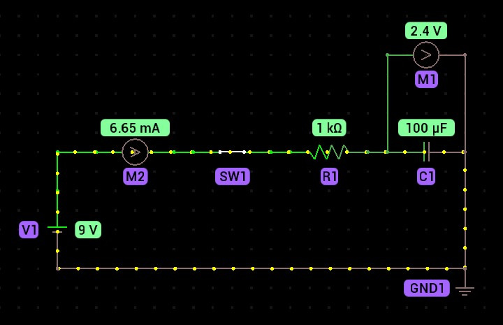
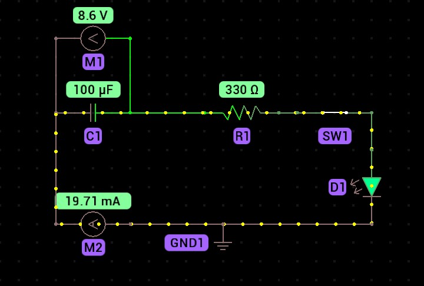
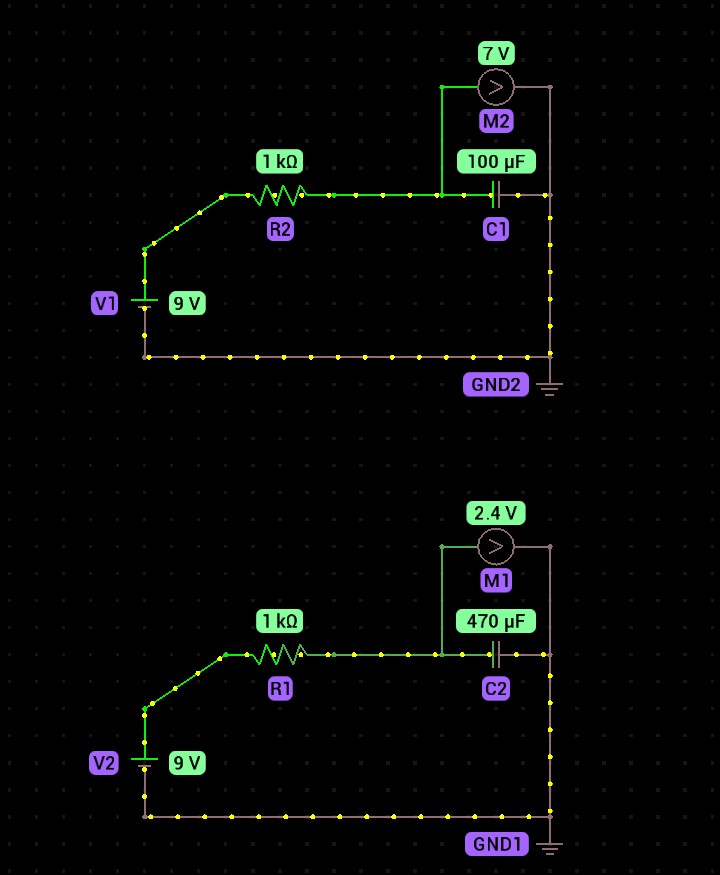
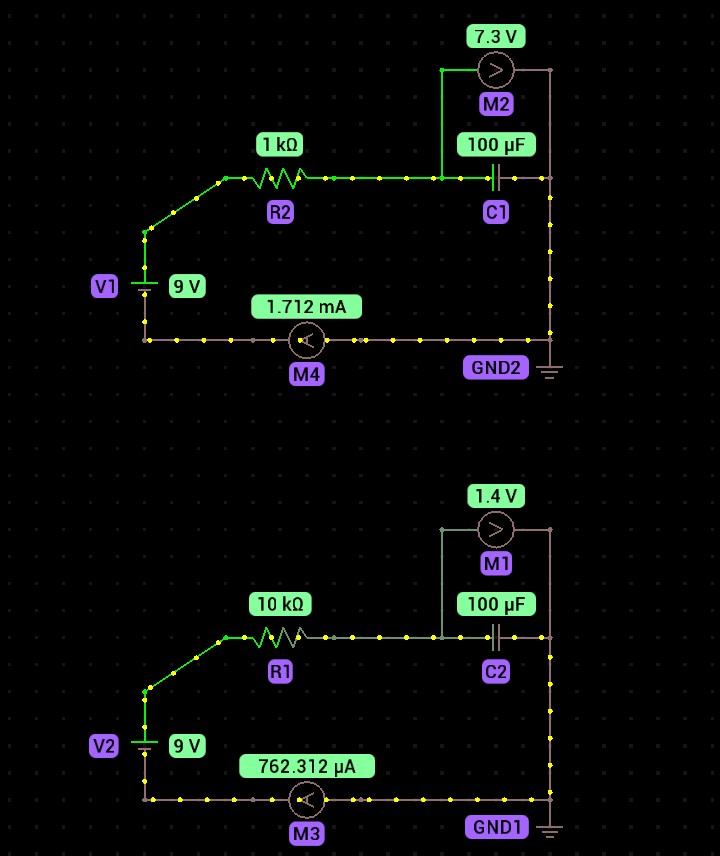
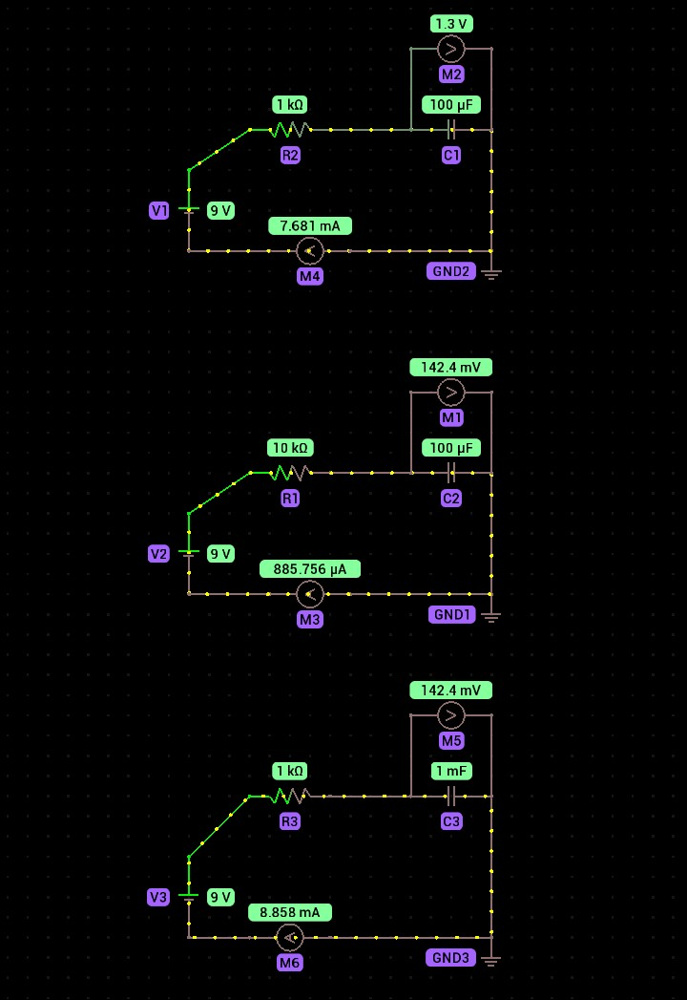

# ⚡ Electronics Phase 02 - Capacitors

## 📖 Introduction

This repository documents my journey of learning about capacitors from first principles. Rather than memorizing formulas, I focused on understanding how capacitors store electrical energy, charge and discharge, and interact with resistance through logical reasoning and practical circuit simulations.

Every concept was reinforced with circuit experiments, predictions, and verification using a circuit simulator. This approach helped me develop engineering intuition instead of relying solely on equations.

---

## 🎯 Learning Objectives

At the end of this phase, I was able to:

- Explain what a capacitor is and how it stores electrical energy.
- Describe capacitance as the ability of a capacitor to store electric charge.
- Explain the relationship between charge, capacitance, and voltage.
- Explain how a capacitor charges when connected to a DC voltage source.
- Explain why charging current decreases as a capacitor charges.
- Describe how a capacitor discharges through a load.
- Explain how stored electrical energy can be released to power a circuit.
- Calculate the energy stored in a capacitor.
- Understand how resistance affects capacitor charging and discharging.
- Understand how capacitance affects charge storage and charging time.
- Explain the RC time constant and its significance in capacitor circuits.

---

## 📚 Topics Covered

- Capacitors
- Electric Charge Storage
- Capacitance
- Capacitor Charging
- Capacitor Discharging
- Stored Electrical Energy
- Charging Current
- Discharge Current
- Resistance and Capacitance
- RC Circuits
- RC Time Constant
- Capacitor Applications

  ---

# 🔬 Practical Experiments

## Experiment 1 - Capacitor Charging

### Description

To investigate how a capacitor behaves when connected to a DC voltage source and observe how its voltage and charging current change over time.

### Hypothesis

Before building the circuit, I predicted that:

- The capacitor voltage would initially be close to 0 V.
- The charging current would initially be high.
- The charging current would decrease as the capacitor voltage increased.
- The capacitor voltage would eventually approach the battery voltage.
- The current would eventually approach 0 A when the capacitor became fully charged.

### Circuit

### Observation

When the circuit was connected, the capacitor voltage gradually increased while the charging current continuously decreased.

The charge movement was initially fast, but became progressively slower as the capacitor voltage approached the battery voltage. Eventually, the capacitor reached approximately 9 V and the charging current approached 0 A.

### Values

| Quantity | Observed Value |
|----------|---------------:|
| Supply Voltage | 9 V |
| Initial Capacitor Voltage | ~0 V |
| Final Capacitor Voltage | 9 V |
| Final Charging Current | 0 A |

### Inference

The experiment demonstrated that as the capacitor charges, its voltage increases while the charging current decreases. Once the capacitor voltage becomes equal to the battery voltage, there is no longer a potential difference driving current through the circuit, so the charging current approaches 0 A.

## Experiment 2 - Capacitor Discharging Through an LED

### Description

To investigate how a charged capacitor releases its stored electrical energy through a load and observe how the capacitor voltage, current, and LED brightness change during discharge.

### Hypothesis

Before performing the experiment, I predicted that:

- The charged capacitor would supply current to the LED.
- The LED would illuminate when connected to the capacitor.
- The LED would gradually become dimmer as the capacitor discharged.
- The capacitor voltage would decrease over time.
- The current would decrease as the capacitor voltage decreased.
- The LED would eventually stop glowing when the capacitor could no longer provide enough energy.

### Circuit

### Observation

After the charged capacitor was connected to the LED through the 330 Ω resistor, the LED illuminated.

As the capacitor discharged, its voltage and current gradually decreased. The LED brightness also reduced as the capacitor voltage decreased until the LED eventually stopped glowing.

### Values

| Quantity | Observed Value |
|----------|---------------:|
| Initial Capacitor Voltage | 9 V |
| Resistor | 330 Ω |
| Capacitor Voltage | Decreased |
| Current | Decreased |
| LED Brightness | Decreased |

### Inference

The experiment demonstrated that a charged capacitor can temporarily supply electrical energy to a load. As the capacitor releases its stored energy, its voltage decreases, causing the current and LED brightness to decrease as well.

## Experiment 3 - Effect of Capacitance

### Description

To investigate how changing the capacitance affects the amount of charge stored by a capacitor and the time required for it to charge to a given voltage.

### Hypothesis

Before performing the experiment, I predicted that:

- A capacitor with greater capacitance would require more charge to reach the same voltage.
- The larger capacitor would therefore store more energy at the same voltage.
- The larger capacitor would take longer to charge when the resistance and supply voltage remained constant.

### Circuit

### Observation

The 470 µF capacitor charged more slowly than the 100 µF capacitor.

At one point during the simulation, when the 470 µF capacitor had reached approximately 2.4 V, the 100 µF capacitor had already reached approximately 7 V.

Both capacitors were connected to the same 9 V supply through the same 1 kΩ resistance.

### Values

| Quantity | 100 µF | 470 µF |
|----------|-------:|-------:|
| Supply Voltage | 9 V | 9 V |
| Resistance | 1 kΩ | 1 kΩ |
| Observed Voltage | 7 V | 2.4 V |

### Inference

The experiment demonstrated that increasing capacitance increases the amount of charge required for a capacitor to reach a given voltage.

Since the 470 µF capacitor has a greater capacitance than the 100 µF capacitor, it required more charge to reach the same voltage and therefore charged more slowly under the same conditions.

The relationship is: Q = CV

## Experiment 4 - Effect of Resistance

### Description

To investigate how changing the resistance affects the current and charging speed of a capacitor while keeping the capacitance and supply voltage constant.

### Hypothesis

Before performing the experiment, I predicted that:

- Increasing the resistance would reduce the charging current.
- Lower current would reduce the rate at which charge flows into the capacitor.
- The capacitor with the higher resistance would therefore charge more slowly.

### Circuit

### Observation

The 1 kΩ circuit had a higher charging current than the 10 kΩ circuit.

The capacitor in the 1 kΩ circuit also charged faster, causing its voltage to increase more rapidly than the capacitor in the 10 kΩ circuit.

### Values

| Quantity | 1 kΩ Circuit | 10 kΩ Circuit |
|----------|-------------:|--------------:|
| Supply Voltage | 9 V | 9 V |
| Capacitance | 100 µF | 100 µF |
| Resistance | 1 kΩ | 10 kΩ |
| Charging Current | Higher | Lower |
| Capacitor Voltage | Higher during charging | Lower during charging |

### Inference

The experiment demonstrated that increasing resistance reduces the current flowing into the capacitor.

Since the 10 kΩ resistor provides greater opposition to current than the 1 kΩ resistor, the capacitor charges more slowly.

This confirms the relationship: I = V/R

## Experiment 5 - Resistance and Capacitance Together

### Description

To investigate how resistance and capacitance work together to affect the charging speed of a capacitor and introduce the RC time constant.

### Hypothesis

Before performing the experiment, I predicted that:

- Increasing resistance would reduce current and slow the charging process.
- Increasing capacitance would increase the amount of charge required to reach a given voltage.
- Both resistance and capacitance would therefore affect the time required for a capacitor to charge.
- Circuits with different resistance and capacitance values could have similar charging times if their RC products were equal.

### Circuit

### Observation

The capacitor voltage in Circuit B and Circuit C was approximately the same during the observed stage of the experiment.

However, the current in Circuit C was higher than the current in Circuit B.

Circuit C used a 1 mF capacitor, which is equivalent to 1000 µF.

### Values

| Circuit | Resistance | Capacitance | Observation |
|---------|-----------:|------------:|-------------|
| B | 10 kΩ | 100 µF | Lower current |
| C | 1 kΩ | 1 mF | Higher current |

### Inference

The experiment demonstrated that resistance and capacitance influence an RC circuit in different ways.

The lower resistance in Circuit C allowed more current to flow compared with Circuit B, while the larger capacitance increased the amount of charge required for the capacitor to reach a given voltage.

The relationship between resistance and capacitance is represented by the RC time constant: τ = RC
